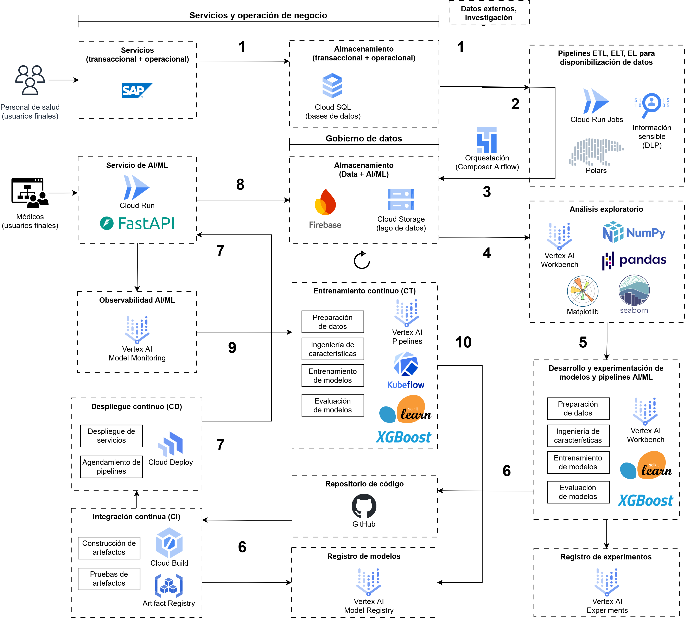

# MLOps Demo Caso Salud

El siguiente repo presenta una propuesta de diseño de pipeline de MLOps y un demo básico MLOps considerando un caso del sector salud.

Contenido:
- [Descripción del problema](#descripción-del-problema)
- [Diseño MLOps](#diseño-mlops)
- [Demo Docker](#demo-docker)
    - [Servicio en local con Docker](#servicio-en-local-con-docker)
    - [Pruebas en local con Docker](#pruebas-en-local-con-docker)
- [Referencias](#referencias)

# Descripción del problema

"Se requiere construir un modelo que sea capaz de predecir, dados los datos de síntomas de un paciente, si es posible o no que este sufra de alguna enfermedad. Esto se requiere tanto para enfermedades comunes (muchos datos) como para enfermedades huérfanas (pocos datos)."

Consideraciones generales asumidas para acotar el problema:
- Los datos disponibles corresponden a síntomas y paraclínicos de los pacientes. No se tienen imágenes diagnósticas, radiografías, ni otro tipo de exámen que requiera procesos complejos de lectura.
- La infraestructura de cómputo utilizada para servir las solicitudes del sistema del servicio de salud prestado es de escala media, de tal manera que la información diaria generada demanda bajas especificaciones de cómputo para almacenamiento y procesamiento, pero el histórico acumulado puede demandar el uso de herramientas escalables, por ejemplo, herramientas de procesamiento distribuido.

# Diseño MLOps

El siguiente diseño es una propuesta específica para el caso considerado:



**1. Fuente de datos**:

Se tienen las siguientes fuentes de datos de información estructurada:
- La fuente de datos principal corresponde a los registros de síntomas y paraclínicos de pacientes, información ingresada por parte del personal de salud a través de los servicios transaccionales y operacionales del sistema, usualmente sistemas SAP, que almacenan dichos registros en la base de datos del servicio de salud prestado. Se asume que la base de datos es relacional OLTP, por ejemplo, PostgreSQL a través de una instancia de Google Cloud SQL.
- La fuente complementaria de datos corresponde a conjuntos de datos de referencia de salud pública de entidades reconocidas, por ejemplo, la Organización Mundial de Salud - OMS (https://www.who.int/data), que sirven para robustecer el volumen de información para el entrenamiento de modelos que requieran mayor número de datos.

**2. Disponibilización de datos**:

Se desarrollan y ejecutan dos tipos de pipelines para disponibilización de datos. Estos tipos de pipelines se diferencian en la extracción:
- Extracción diaria de la información bruta de la base de datos del servicio de salud utilizando el lenguaje SQL y utilidades de línea de comandos para bases de datos como `psql` que permite almacenar la información en formato CSV.
- Extracción semanal de conjuntos de datos de referencia de las entidades reconocidas de salud a través de solicitudes HTTP.

Una vez extraída la información, se pre-procesa la información transformando datos con la librería Polars de Python para corregir formatos y limpiar datos erróneos; y posteriormente se emplea el servicio DLP de Google Cloud para enmascarar, ocultar, y remover información sensible de los pacientes como medida de protección y privacidad de datos de los pacientes.

La ejecución de estos pipelines ETL de datos se realiza a través de instancias de Google Cloud Run Jobs (ambiente serverless de ejecución de trabajos Batch), y se  automatizan y orquestan como DAGs de Apache Airflow a través Google Cloud Composer (implementación manejada de Apache Airflow).

**3. Almacenamiento de datos para analítica y AI/ML**:

Se almacena la información pre-procesada en un bucket de Google Cloud Storage (servicio de almacenamiento de objetos), empleado como lago de datos para facilitar el acceso y distribución de los datos. El formato de archivo utilizado es Parquet para mayor eficiencia de compresión, y por tanto de almacenamiento y transmisión de datos.

**4. Análisis exploratorio de datos**:

En una instancia de Vertex AI Workbench (instancia manejada de Jupyter Lab) se realiza el análisis exploratorio de datos donde se identifican las distribuciones de los datos, se evalúa la necesidad y posibilidad de imputar datos, se corrigen posibles desbalances de categorías que requieran un submuestreo, se buscan posibles correlaciones de los síntomas, paraclínicos y las condiciones de salud; y se definen características (features) para la construcción de modelos. Se emplean las librerías Numpy y Pandas para procesamiento de datos, así como las librerías Matplotlib y Seaborn para visualización de datos.

**5. Desarrollo y experimentación de modelos y pipelines AI/ML**:

En una instancia de Vertex AI Workbench (instancia manejada de Jupyter Lab) se normalizan y codifican los datos; se seleccionan los tipos de modelos de árboles de decision (random forest), XGBoost, y red MLP (Multilayer Perceptron) para clasificación multiclase de las posibles enfermedades de los pacientes; y se aplica un protocolo de optimización mediante validación cruzada con datos de entrenamiento (80%), y evaluación con datos de prueba (20%), utilizando Vertex AI Experiments como herramienta de seguimiento de experimentos para registrar las métricas de clasificación multiclase como F1, precisión, exhaustividad (recall), y matriz de confusión de las iteraciones del proceso.

Una vez establecido el modelo con mejor desempeño, se crea un pipeline de Scikit-learn compuesto por el procesamiento de los datos de entrada (normalización, codificación) y predicción, que se serializa en formato PKL como serialización Pickle soportada por Python, y se sube a Vertex AI Model Registry.

**6. Integración continua (CI)**:

Se ajusta en el repositorio de código la configuración que referencia el nuevo modelo a utilizar y se sube el cambio correspondiente a una rama del repositorio remoto de Git que define el servicio RESTful desarrollado con FastAPI en Python, compatible con el formato PKL, que posteriormente inicia la ejecución de un pipeline de integración continua a través del servicio Google Cloud Build (servicio serverless de CI), que evalúa las pruebas unitarias sobre las predicciones del servicio, y crea una imagen de contenedor como artefacto de despliegue del servicio.

**7. Despliegue continuo (CD):**

Se actualiza una configuración de Google Cloud Deploy (servicio serverless de CD) para desplegar de manera continua la nueva versión del servicio RESTful de predicción en Google Cloud Run (servicio serverless de ejecución de servicios).

**8. Almacenamiento de datos de entrada del servicio de predicción en producción:**

Los registros de síntomas y paraclínicos de pacientes correspondientes a datos de entrada del servicio RESTful de predicción en producción se almacenan en Firebase (base de datos serverless de Google Cloud). Esta información es de especial interés para evaluar posteriormente cambios de deriva de datos, descrito en la siguiente sección.

**9. Observabilidad AI/ML:**

Al final de cada día se ejecutan trabajos programados en Vertex AI Model Monitoring que alerten sobre:
* Deriva de los datos de entrada del servicio RESTful de predicción.
* Deriva de los nuevos datos en la base de datos del servicio de salud prestado.
* Disminución en las métricas de desempeño del modelo, evaluadas a partir de los nuevos datos y sus correspondientes etiquetas de enfermedad definidas por el personal médico.

Estas posibles alertas inician el reentrenamiento de modelos como proceso continuo.

**10. Entrenamiento continuo (CT):**

El entrenamiento del modelo empleado en producción se automatiza a través de Vertex AI Pipelines y Kubeflow considerando los tipos de modelos utilizados previamente en la etapa de desarrollo, de tal manera que se optimice un nuevo modelo con mejor desempeño a partir de los nuevos datos disponibles del servicio de salud prestado. Una vez establecido el pipeline de Scikit-learn compuesto por el procesamiento de datos de entrada y predicción con el nuevo modelo entrenado, se surten automáticamente los pasos descritos previamente en la etapa de desarrollo del modelo, específicamente, respecto a serialización del modelo y registro en Vertex AI Model Registry.

Posteriormente, se automatiza el ajuste en el repositorio de código de la configuración que referencia el nuevo modelo a desplegar, y se surten las etapas de integración y despliegue continuos (CI/CD) descritas previamente.

# Demo Docker

El siguiente es un servicio básico RESTful HTTP para implementar operaciones de MLOps. Este servicio retorna las siguientes categorías de condición de enfermedad de un paciente a partir de la temperatura, el ritmo cardiaco, y la presión sanguínea como parámetros de consulta (query params):
- "NO ENFERMO"
- "ENFERMEDAD LEVE"
- "ENFERMEDAD AGUDA"
- "ENFERMEDAD CRÓNICA"
- "ENFERMEDAD TERMINAL"

NOTAS:
- EL SERVICIO DE PREDICCIÓN DE ENFERMEDAD ES UNA FUNCIONALIDAD SIN NINGÚN SUSTENTO MÉDICO, SOLO ES UN MOCK DE UN MODELO DE CLASIFICACIÓN.
- El historial de predicciones se almacena en memoria, no se tiene persistencia durable

## Servicio en local con Docker

Construcción y ejecución local con Docker:
```bash
# construir imagen
docker build -t svc-demo-salud .

# ejecutar contenedor en puerto 5000
docker run --rm --name demo-salud -p 5000:80 svc-demo-salud
```

Solicitar predicciones a través del navegador web:
- http://localhost:5000/predict?temperature=36&heart_rate=120&blood_pressure=90
- http://localhost:5000/predict?temperature=38&heart_rate=120&blood_pressure=90
- http://localhost:5000/predict?temperature=38.5&heart_rate=140&blood_pressure=90
- http://localhost:5000/predict?temperature=36&heart_rate=150&blood_pressure=180
- http://localhost:5000/predict?temperature=34.9&heart_rate=59&blood_pressure=89

Solicitar historial de predicciones:
- http://localhost:5000/predictions-history

En su defecto en terminal:
```bash
# solicitar predicción: método GET
curl "http://localhost:5000/predict?temperature=36&heart_rate=120&blood_pressure=90"

# solicitar predicción: método POST
curl -X POST "http://localhost:5000/predict?temperature=36&heart_rate=120&blood_pressure=90"

# solicitar historial de predicciones
curl http://localhost:5000/predictions-history
```

Remover imagen de docker:
```bash
docker rmi svc-demo-salud
```


## Pruebas en local con Docker

Construcción y ejecución de pruebas en local con Docker:
```bash
# construir imagen
docker build -t svc-demo-salud:tests -f Dockerfile.tests .

# ejecutar contenedor de pruebas
docker run --rm --name demo-salud-tests svc-demo-salud:tests
```


# Referencias

- https://cloud.google.com/discover/what-is-mlops
- https://cloud.google.com/architecture/mlops-continuous-delivery-and-automation-pipelines-in-machine-learning
- https://fastapi.tiangolo.com/deployment/docker/
